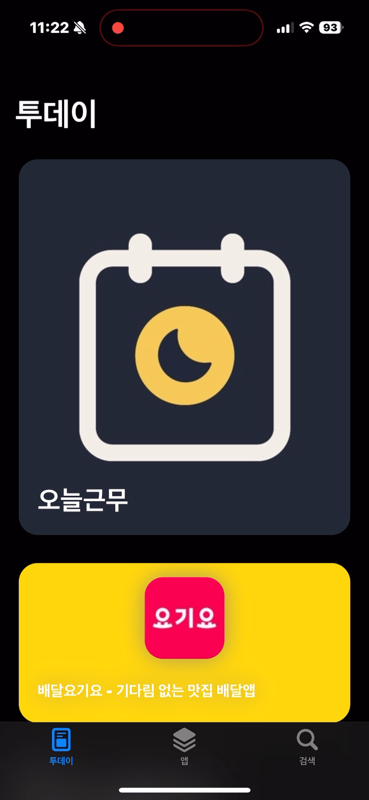
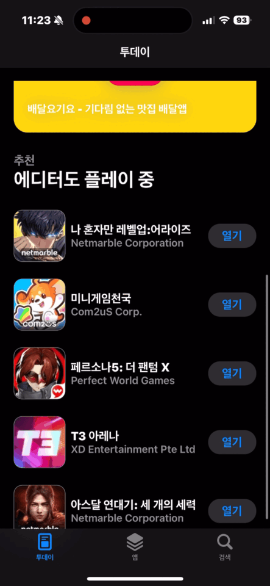
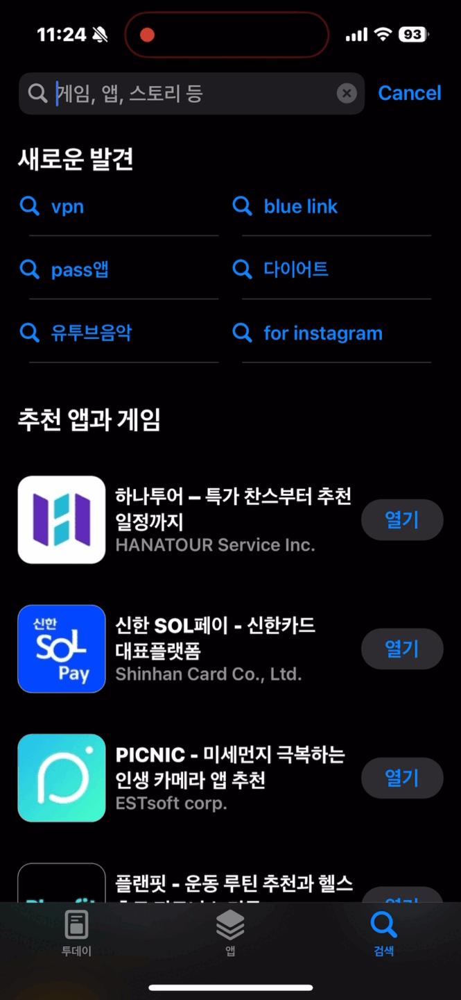
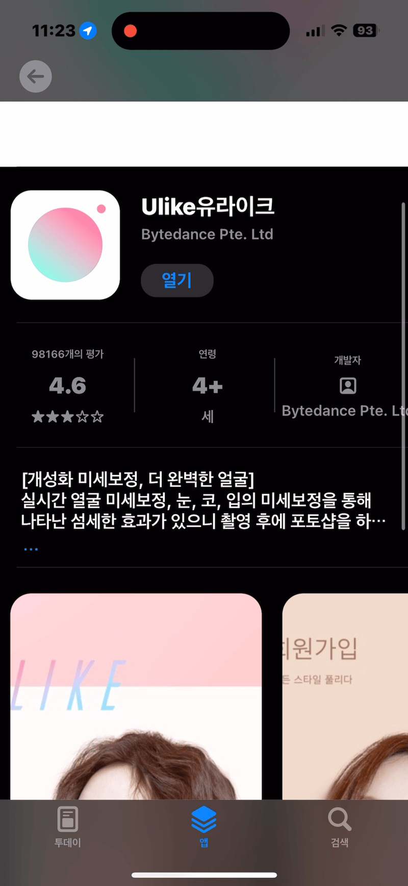
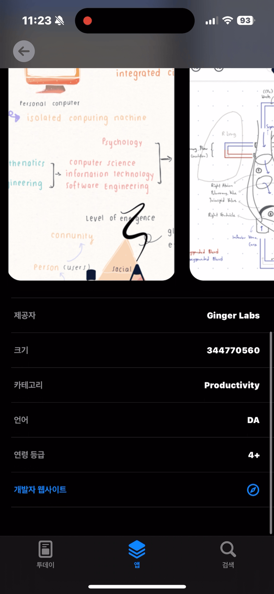

# App Store

## 프로젝트 설명

Apple의 Itunes API로 부터 받은 정보를 App Store와 비슷한 UI로 구성한 앱으로  API 연동, CompositionalLayout을 통한 복잡한 레이아웃, 커스텀 애니메이션 등을 적용

## 사용 기술
Swift, UIKit, SnapKit, Compositional Layout, RXSwift, RxCocoa, RxDataSources

## 주요 화면

### 투데이 화면

- 앱 스토어의 투데이 탭에서 볼 수 있는 커스텀 애니메이션 구성

    
    
    

### 앱 화면

- Composition Layout과 URLSession을 통한 API 통신을 RxSwift를 통해 바인딩하여 다양한 UI 레이아웃 구성

    

### 검색 화면

- 새로운 발견에서 단어를 탭 시 해당 단어를 검색어로 API 요청
- 서치바를 통해 Itunes API에 앱 리스트를 요청하고 결과를 UI로 그림

    
    

### 네비게이션 화면

- 앱을 탭 할 시 앱 디테일 네비게이션으로 이동하며 앱의 자세한 정보를 표시
- 긴 글자를 축약해서 보여주며 더보기 버튼 탭시 테이블 뷰의 높이를 동적으로 조정

    
    

- 열기 버튼 탭 시 앱의 TrackID와 딥링크를 통해 앱스토어로 연결
- 개발자 웹사이트라는 Label 탭 시 외부 Safari로 이동
- 컬렉션 뷰에서 현재 스크롤 위치를 활용한 Group Paging

    
    
    

## **기술적 도전**

**MVVM, RxSwift**

> MVVM 패턴을 채용하며, 뷰에 대한 데이터를 바인딩 하는데 RxSwift를 이용했습니다. API 응답 결과를 Observable로 래핑하여 Service 레이어에 전달하고 Service로부터 Observable 데이터를 ViewModel에서 받아 온 후 뷰에 바인딩하였습니다.
> 

**Coordinator Pattern**

> 뷰 컨트롤러간 화면 전환 시 매번 어떤 VC가 다음 VC에 대한 설정 값을 가지고 화면을 이동시키는 책임을 분리하기 위하여 코디네이터 패턴을 적용했습니다. 앱 전체를 아우르는 코디네이터에 탭바를 넣고 각 탭 화면마다 코디네이터를 가지게 하여 복잡한 화면 전환 책임을 코디네이터에게 위임하였습니다.
> 

**Compositional Layout**

> 하나의 컬렉션 뷰에 다양한 레이아웃을 적용하기 위해 Compositional Layout을 사용했습니다. 각 뷰의 성격에 맞는 섹션과 아이템을 Datasource에 설정하고 API로부터 받아온 결과를 다양한 UI로 표현했습니다.
> 

**Custom Presentation**

> 앱 스토어와 비슷한 방식으로 한 뷰컨트롤러에서 다른 뷰컨트롤러를 present하는 과정에서 UIViewControllerTransitioningDelegate로 커스텀 트랜지션 모델을 생성 , UIViewControllerAnimatedTransitioning을 통해 뷰가 전환되는 애니메이션을 커스텀했습니다.
> 

**External Naivagiton**

> UIKit으로 개발한 iOS 어플리케이션 내부에서의 이동 이외에 trackID와 딥링크를 이용한 앱 스토어 이동, 외부 사파리 화면 이동을 구현했습니다.
> 

**Common API Component**

> Enum을 통해 API 요청시 Host, Parameter, Body 등을 구조화했습니다.
